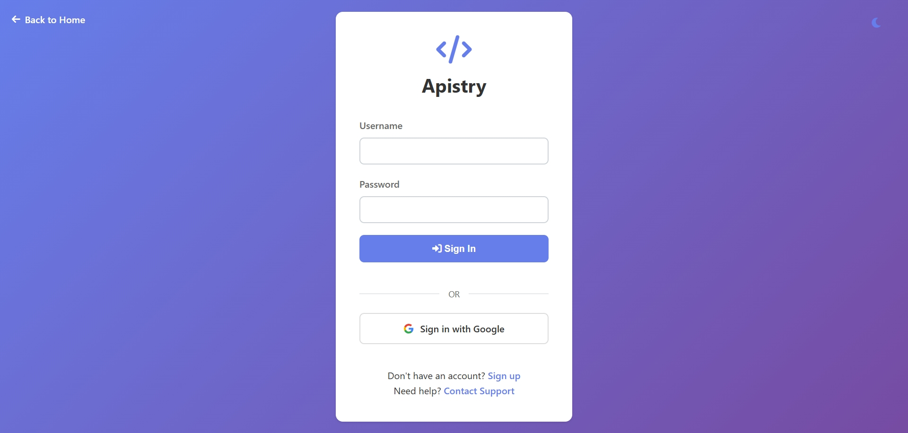
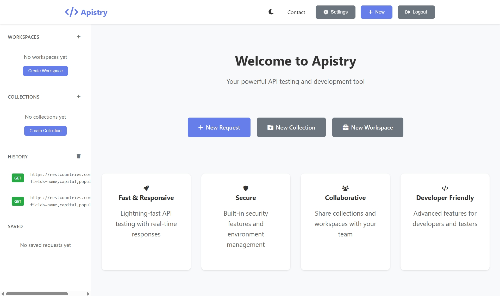
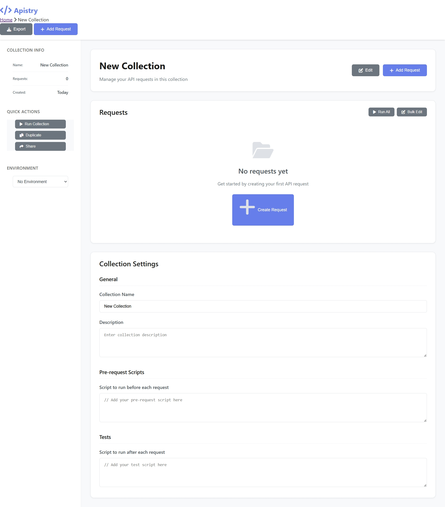

# 🚀 Apistry – API Testing & Collaboration Platform

Apistry is a **full‑stack API testing and collaboration platform** designed to help developers **create, test, manage, and organize APIs** efficiently. Inspired by tools like Postman, Apistry combines **API request execution**, **collection & workspace management**, and **secure authentication** into a single web-based solution.

Built using **Spring Boot** with a modern, responsive frontend, Apistry is ideal for **learning, capstone projects, and portfolio demonstrations**.

---

## 📌 Key Features

- 🔐 **User Authentication & Authorization**
  - Secure login and registration
  - Password encryption using BCrypt
  - Session-based authentication

- 📊 **Dashboard & Workspace Management**
  - Personalized dashboard after login
  - Project-based workspace organization

- 📁 **API Collection Management**
  - Group related API requests into collections
  - Organize APIs by project or purpose

- 📨 **API Request Builder & Execution**
  - Support for GET, POST, PUT, DELETE, PATCH
  - Headers, parameters, and request body support
  - View response status, headers, and body

- 🌍 **Environment Variables**
  - Manage dev, staging, and production environments
  - Dynamic variable substitution in requests

- 🕘 **Request History**
  - Track and review previously executed API calls

- 📱 **Responsive UI**
  - Works seamlessly on desktop and mobile devices

---

## 🛠️ Technology Stack

### Backend
- **Java 17**
- **Spring Boot 3.5.4**
- Spring MVC
- Spring Security
- Spring Data JPA
- Thymeleaf
- PostgreSQL
- Lombok
- Maven

### Frontend
- HTML5
- CSS3
- JavaScript (ES6+)
- Thymeleaf
- Font Awesome

---

## 📂 Project Structure

```
src/
├── main/
│   ├── java/com/capstone/apistry/
│   │   ├── ApistryApplication.java
│   │   ├── auth/
│   │   ├── controllers/
│   │   ├── entities/
│   │   ├── repositories/
│   │   ├── services/
│   │   └── utils/
│   └── resources/
│       ├── static/          # CSS & JavaScript
│       ├── templates/       # Thymeleaf HTML pages
│       └── application.properties
│
├── database_setup.sql
├── pom.xml
└── README.md
```

---

## 🖼️ Project Screenshots

Below are screenshots of the Apistry application UI and workflow.

> 📁 **All screenshots must be placed inside the `screenshots/` folder at the root of the repository.**  
> You only need to replace the image files — the links below will automatically render on GitHub.

### 🔑 Login Page
*User login interface with email/username and password authentication.*



### 📝 Registration Page
*New user registration form with validation.*


### 📊 Dashboard
*Main dashboard displayed after successful login, showing user workspace overview.*



### 📁 API Collections
*Page for creating and managing API request collections.*



### 📨 API Request Builder
*Interface for building and executing API requests (method, headers, body, response).*


### 🧑‍💻 Workspace View
*Workspace-based project organization and collaboration view.*


---


## ⚙️ Getting Started

### Prerequisites
- Java 17 or higher
- Maven 3.6+
- PostgreSQL 12+

### Installation

1. **Clone the repository**
   ```bash
   git clone <repository-url>
   cd Apistry
   ```

2. **Database setup**
   - Create a PostgreSQL database
   - Run the SQL file:
     ```sql
     database_setup.sql
     ```

3. **Configure application properties**
   ```properties
   spring.datasource.url=jdbc:postgresql://localhost:5432/apistry
   spring.datasource.username=your_username
   spring.datasource.password=your_password
   ```

4. **Build & run**
   ```bash
   mvn clean install
   mvn spring-boot:run
   ```

5. **Access the application**
   ```
   http://localhost:8080
   ```

---

## 🔐 Authentication & Security

### Public Routes
- `/` – Homepage
- `/login` – Login
- `/register` – Registration
- `/css/**`, `/js/**` – Static resources

### Protected Routes
- `/dashboard`
- `/workspace/**`
- `/collection/**`
- `/request/**`
- `/environments`

### Security Features
- BCrypt password hashing
- Session-based authentication
- CSRF disabled for API testing (enable for production)
- Expandable role-based access control

---

## ☁️ Deployment

Apistry can be deployed **completely free** using:

- **Render (Recommended)** – Free Spring Boot hosting + PostgreSQL
- Railway
- Koyeb + Neon PostgreSQL

The application supports cloud deployment using environment variables for database and security credentials.

---

## 🚧 Roadmap

### Phase 1 (Completed)
- ✅ Authentication system
- ✅ Dashboard & workspace
- ✅ API request execution
- ✅ Collections & environments

### Phase 2 (Planned)
- ⏳ Collection import/export (Postman format)
- ⏳ Team collaboration
- ⏳ API documentation generation

### Phase 3 (Future)
- ⏳ GraphQL support
- ⏳ Performance testing
- ⏳ CI/CD integration

---

## 👨‍💻 Author

**Anubhav Singh**  
Capstone Project – API Testing & Collaboration Platform

---

## 📜 License & Usage

© 2025 Anubhav Singh

This project is made **public for viewing and evaluation purposes only**.

❌ Cloning, downloading, modifying, or redistributing this project **without explicit permission from the author is prohibited**.

---

⭐ If you find this project useful, feel free to star the repository!

